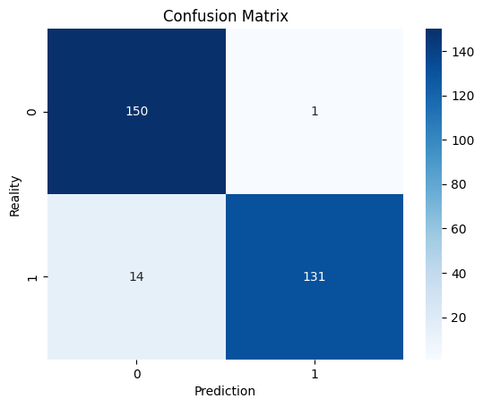

# Credit Card Fraud Detection with Machine Learning

## Project Overview
This project demonstrates the process of building a credit card fraud detection system using machine learning techniques.

The project utilizes a variety of classification models to achieve the best accuracy, with a particular focus on handling **imbalanced data** using **sub-sampling** and **hyperparameter tuning** to improve model performance.

## Key Learnings
- **Data Preprocessing**: 
    - Cleaning and scaling data for optimal model performance.
    - Handling imbalanced datasets through sub-sampling.
  
- **Model Selection**: 
    - Utilized a variety of classifiers such as Logistic Regression, K-Nearest Neighbors, Support Vector Classifier, Decision Trees, and Random Forests.
  
- **Hyperparameter Tuning**: 
    - Applied **GridSearchCV** to find the best hyperparameters for each model, ensuring the highest performance for each classifier.
  
- **Model Evaluation**: 
    - Employed **cross-validation** to evaluate model performance.
    - Utilized various metrics including **accuracy**, **precision**, **recall**, and **f1-score** to assess the performance of each model.

## Notes
- For additional details about the dataset, model evaluations, and comparisons between different models check out the **[notes.txt](notes.txt)** file in this repository.



## Tech Stack
- **Python**: Main programming language.
- **Libraries**: 
    - **scikit-learn**: For implementing machine learning models, GridSearchCV, and performance evaluation.
    - **pandas**: For data manipulation and cleaning.
    - **numpy**: For numerical operations.
    - **matplotlib & seaborn**: For data visualization.
- **Jupyter Notebook**: For development and visualization.
  
## Project Setup

```bash
git clone https://github.com/Egehan134/credit-fraud-detection.git
cd credit-fraud-detection
pip install -r requirements.txt
```

### Dataset Information:
- **Dataset**: [Credit Card Fraud Detection Dataset on Kaggle](https://www.kaggle.com/datasets/mlg-ulb/creditcardfraud)


